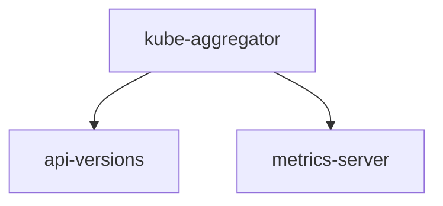

# Metrics Server

> 从 v1.8 开始，资源使用情况的度量（如容器的 CPU 和内存使用）可以通过 Metrics API 获取；前提是集群中要部署 Metrics Server，它从Kubelet 公开的Summary API采集指标信息，[关于更多的背景介绍请参考文档](https://github.com/kubernetes/community/blob/master/contributors/design-proposals/instrumentation/metrics-server.md) 

## Metrics-server(服务资源指标的api)

早期的核心指标数据是由heapster提供，1.11版本开始废弃，1.12彻底废弃-  ,1.13已经退休

依赖于[kube-aggregator](https://github.com/kubernetes/kube-aggregator)，因此需要在apiserver中开启相关参数

1. 新的指标数据由Metrice-server 聚合提供
2. API server 服务于(CPU累计使用率，内存实时使用率，Pod的资源占用率及容器的磁盘占用率)
3. 托管在kubernetes上的Pod

## Metrics工作流

1. Kube-aggregator: 聚合不同组的api 统一
2. /apis/metrics.k8s.io/v1beta1 由metrics server提供
3. 通过kube-aggregator(聚合器)  访问/apis/metrics.k8s.io/v1beta1和其他的$(kubectl api-versions)




## 1.Install

Metrics-server已经默认集成在集群安装脚本中，请查看`roles/cluster-addon/defaults/main.yml`中的设置

#### 设置apiserver相关[参数](../../roles/kube-master/templates/kube-apiserver.service.j2)

``` bash
... # 省略
  --requestheader-client-ca-file={{ ca_dir }}/ca.pem \
  --requestheader-allowed-names=aggregator \
  --requestheader-extra-headers-prefix=X-Remote-Extra- \
  --requestheader-group-headers=X-Remote-Group \
  --requestheader-username-headers=X-Remote-User \
  --proxy-client-cert-file={{ ca_dir }}/aggregator-proxy.pem \
  --proxy-client-key-file={{ ca_dir }}/aggregator-proxy-key.pem \
  --enable-aggregator-routing=true \
```
#### 生成[aggregator proxy相关证书](../../roles/kube-master/tasks/main.yml)

参考1：https://kubernetes.io/docs/tasks/access-kubernetes-api/configure-aggregation-layer/  
参考2：https://kubernetes.io/docs/tasks/access-kubernetes-api/setup-extension-api-server/

## 2.Validation

查看生成的新api：v1beta1.metrics.k8s.io

``` bash
$ kubectl get apiservice|grep metrics
v1beta1.metrics.k8s.io                 1d
```

查看kubectl top命令（无需额外安装heapster）

``` bash
$ kubectl top node
NAME           CPU(cores)   CPU%      MEMORY(bytes)   MEMORY%   
192.168.1.1   116m         2%        2342Mi          60%       
192.168.1.2   79m          1%        1824Mi          47%       
192.168.1.3   82m          2%        1897Mi          49%  
$ kubectl top pod --all-namespaces 	# 输出略
```

- 验证基于metrics-server实现的基础hpa自动缩放，请参考[hpa.md](hpa.md)

## 补充

目前dashboard插件如果想在界面上显示资源使用率，它还依赖于`heapster`；另外，测试发现k8s 1.8版本的`kubectl top`也依赖`heapster`，因此建议补充安装`heapster`，无需安装`influxdb`和`grafana`。

``` bash
$ kubectl apply -f /etc/ansible/manifests/heapster/heapster.yaml
```

